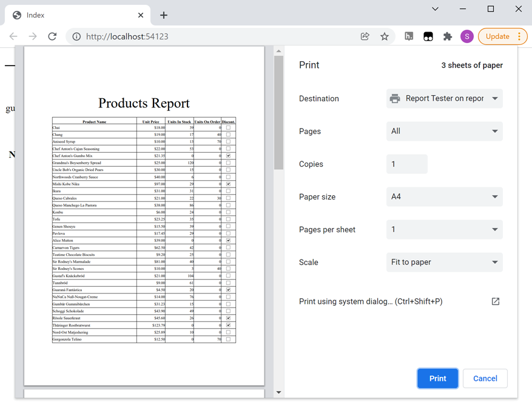

<!-- default badges list -->

<!-- default badges end -->

# Reporting for ASP.NET MVC - How to print or export a report without showing a preview

This example demonstrates how to print or export a report in an ASP.NET MVC application without displaying this report's preview.

Follow the steps below to print or export a report:

* Call one of the report's **ExportTo...** methods to obtain an exported document.
* Call the [Controller.File](https://learn.microsoft.com/en-us/dotnet/api/system.web.mvc.controller.file) method to convert the exported document into a FileContentResult object.

Follow the steps below to print a report:

* Export the report to PDF.
* Return the exported PDF file as an action result with the **Content-Disposition** header set to *inline*.
* The returned PDF is opened by the browser's built-in PDF viewer. To avoid this, export the PDF to a separate iframe - only the print dialog is displayed.

<!-- default file list -->
## Files to Review

* [FilterConfig.cs](./CS/T569785/App_Start/FilterConfig.cs) (VB: [FilterConfig.vb](./VB/T569785/App_Start/FilterConfig.vb))
* [RouteConfig.cs](./CS/T569785/App_Start/RouteConfig.cs) (VB: [RouteConfig.vb](./VB/T569785/App_Start/RouteConfig.vb))
* [WebApiConfig.cs](./CS/T569785/App_Start/WebApiConfig.cs) (VB: [WebApiConfig.vb](./VB/T569785/App_Start/WebApiConfig.vb))
* [HomeController.cs](./CS/T569785/Controllers/HomeController.cs) (VB: [HomeController.vb](./VB/T569785/Controllers/HomeController.vb))
* [ExportModel.cs](./CS/T569785/Models/ExportModel.cs) (VB: [ExportModel.vb](./VB/T569785/Models/ExportModel.vb))
* [Index.cshtml](./CS/T569785/Views/Home/Index.cshtml)
<!-- default file list end -->

## More Examples

* [E454: How to print a report without displaying it in a web application](https://supportcenter.devexpress.com/ticket/details/e454/how-to-print-a-report-without-displaying-it-in-a-web-application)
* [How to print/export XtraReport in an ASP.NET WebForms application without showing a report preview](https://supportcenter.devexpress.com/ticket/details/t227361/how-to-print-export-xtrareport-in-an-asp-net-webforms-application-without-showing-a)
* [How to print and export DevExpress reports without previewing them on a web page in an ASP.NET Core Angular application](https://github.com/DevExpress-Examples/Reporting-Angular-Print-Without-Preview)

<!-- feedback -->
## Does this example address your development requirements/objectives?

 

(you will be redirected to DevExpress.com to submit your response)
<!-- feedback end -->
